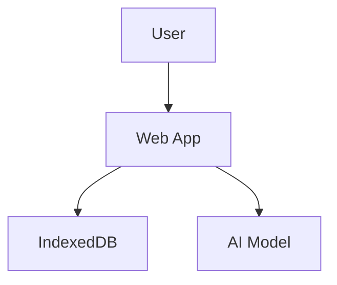

# Genesis Customization: Documentation

> Part of [Customization Guide](../03-CUSTOMIZATION-GUIDE.md)

---

## Add Custom Sections to README

Edit `templates/project-structure/README-template.md`:
```markdown
## Custom Section

Your custom content here.

### Subsection

More custom content.
```

---

## Add Custom Architecture Diagrams

Edit `templates/docs/architecture/ARCHITECTURE-template.md`:
```markdown
## System Architecture


```

---

## Add Custom Deployment Guides

Create new file `templates/docs/deployment/CUSTOM-DEPLOYMENT-template.md`:
```markdown
# Custom Deployment Guide

Your deployment instructions here.
```

